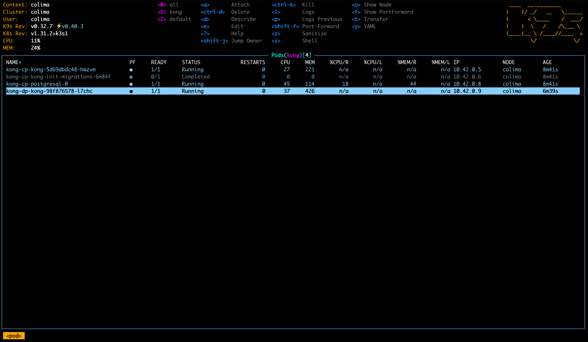
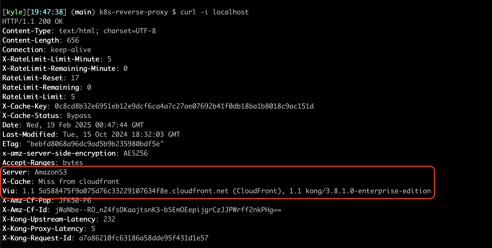
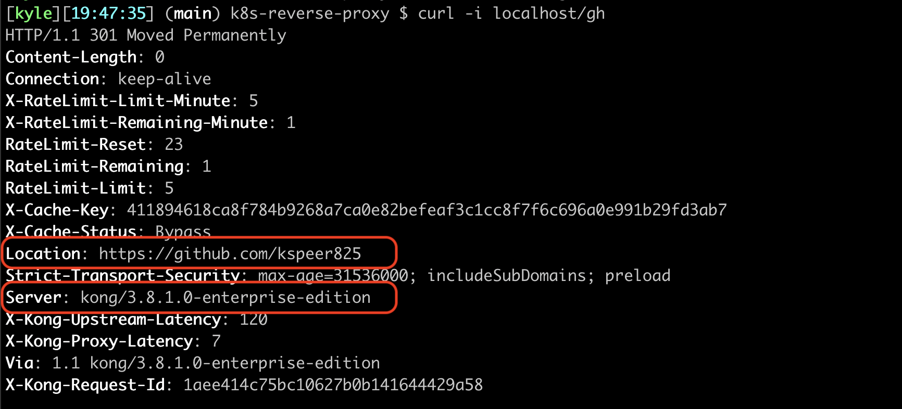
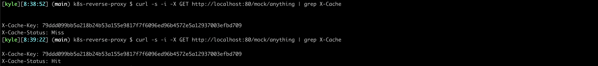
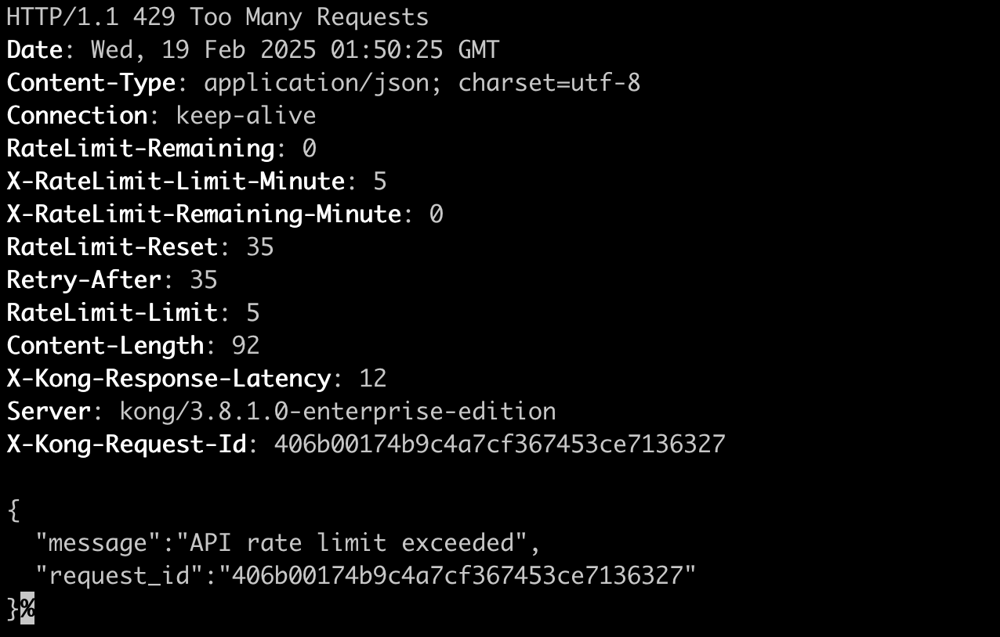

# Kubernetes Reverse Proxy
[Kong](https://konghq.com/) offers an open source reverse proxy service built on top of nginx that can run on [Kubernetes](https://docs.konghq.com/gateway/3.8.x/install/kubernetes/proxy/).

This repo demos how to spin up an instance of the reverse proxy locally.

- [Demo](#demo)
  - [Setup](#setup)
  - [Teardown](#teardown)
- [Use Cases](#use-cases)
  - [Reverse Proxy](#reverse-proxy)
  - [Response Caching](#response-caching)
  - [Rate Limiting](#rate-limiting)





## Demo

### Dependencies
* [colima](https://github.com/abiosoft/colima) local K8s orchestration
* [kubectl](https://kubernetes.io/docs/tasks/tools/install-kubectl-macos/) K8s CLI
* [helm](https://helm.sh/docs/intro/quickstart/) K8s package manager
* [k9s](https://k9scli.io/) (optional) K8s terminal-based UI

### Setup
Start up the reverse proxy services:
```
$ make bootstrap

▶️  Bootstrapping Kong 🦍...

▶️  Pulling helm charts...
Hang tight while we grab the latest from your chart repositories...
...Successfully got an update from the "kong" chart repository
...Successfully got an update from the "bitnami" chart repository
Update Complete. ⎈Happy Helming!⎈

▶️  Setting up kong namespace ...
namespace/kong created
secret/kong-enterprise-license created

▶️  Setting cluster certs...
secret/kong-cluster-cert created

▶️  Helm install kong-cp:
NAME: kong-cp
LAST DEPLOYED: Thu Feb 13 15:43:12 2025
NAMESPACE: kong
STATUS: deployed
REVISION: 1

▶️  Waiting for CP to spin up...

▶️  Helm install kong-dp:
NAME: kong-dp
LAST DEPLOYED: Thu Feb 13 15:45:17 2025
NAMESPACE: kong
STATUS: deployed
REVISION: 1

▶️  Bootstrap complete.
```

Enable port forwarding in a separate shell:
```
$ make port-forward  # exposes 8001,8005
```
Configure an endpoint:
```
$ curl -s "localhost:8001/services" -d name=mock -d url="https://httpbin.konghq.com" | jq .
$ curl -s "localhost:8001/services/mock/routes" -d "paths=/mock" | jq .
```
Validate that requests can be proxied:
```
$ make test

✅ Kong CP is Active.
✅ Kong DP is Active.
```
There should be three healthy services running; the control plane, the data plane, and the database.

### Teardown
```
$ make nuke

🧨 NUKING Kong...
release "kong-cp" uninstalled
release "kong-dp" uninstalled
namespace "kong" deleted
INFO[0000] stopping colima
INFO[0000] stopping ...                                  context=kubernetes
INFO[0004] stopping ...                                  context=docker
INFO[0010] stopping ...                                  context=vm
INFO[0014] done
```

Note: This local implementation relies on running a [k3s](https://k3s.io/) node using colima. This can be ran independently from the reverse proxy services for other use cases.
```
colima start --kubernetes
```

## Use Cases

### Reverse Proxy

A reverse proxy enables a single ingress point to upstream web services. The Kong Gateway accomplishes this through path-based routing. This is useful for scenarios where you have upstream web apps or APIs that are non-public facing, but still require secure ingress from the internet. You can configure paths to your private web services in Kong, expose the K8s ingress entry-point, and apply one of the supported authentication methods at the proxy level (see [Kong Auth plugins](https://docs.konghq.com/hub/?tier=free&category=authentication)).

#### Configure
Endpoint A:
```
curl "localhost:8001/services" -d name=serviceA -d url="https://speerportfolio.com"

curl "localhost:8001/services/serviceA/routes" -d paths="/"
```

Endpoint B:
```
curl "localhost:8001/services" -d name=serviceB -d url="https://github.com/kspeer825"

curl "localhost:8001/services/serviceB/routes" -d paths="/gh" -d preserve_host=true
```

#### Validate

You can now proxy requests from the local K8s cluster to different domains using the `/` and `/gh` paths: [localhost/](https://localhost/) and [localhost/gh](https://localhost/gh).





### Response Caching

Responses for frequently made requests can be cached at your ingress point in order to reduce response times, and lighten the load on upstream services. The open source [Proxy Cache](https://docs.konghq.com/hub/kong-inc/proxy-cache/) plugin can be configured based on request method, content type, and status code. It can be applied to a specific endpoint or requester.

#### Configure:
```
curl "localhost:8001/plugins" -d "name=proxy-cache" -d "config.request_method=GET" -d "config.response_code=200" -d "config.content_type=application/json" -d "config.cache_ttl=30" -d "config.strategy=memory"
```

#### Validate:
```
curl -s -i -X GET http://localhost:80/mock/anything | grep X-Cache
```




### Rate Limiting

Rate limiting can be enabled in order to protect against DOS attacks, or to limit usage on upstream services. The open source [Rate Limiting](https://docs.konghq.com/hub/kong-inc/rate-limiting/) plugin can be configured based on requests per unit time (second, minute, hour, etc.). It can be applied to a specific endpoint or requester, and can aggregate requests by various fields.

#### Configure:
```
curl localhost:8001/plugins -d "name=rate-limiting" -d "config.minute=5" -d "config.policy=local"

```

#### Validate:
```
for _ in {1..6}; do curl -i -s localhost:80/mock/anything; sleep 1; done
```


